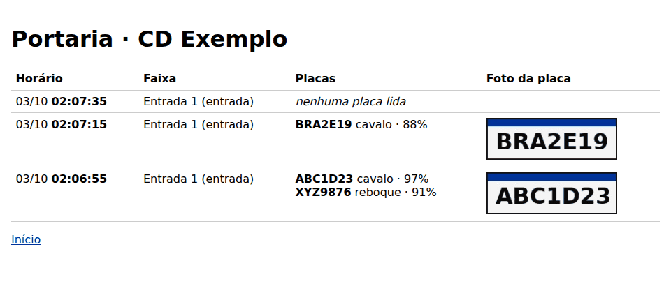

# Demonstração do mês 1

O marco do mês (plano do mês 1, seção 1): uma passagem sai da caixa de borda, chega à API e
**aparece na tela da portaria** com foto, placa e confiança.

Hoje a demonstração usa o **simulador** no papel da caixa, com uma amostra de passagens
inventadas (placas inventadas e fotos de placa desenhadas). Com vídeo gravado de verdade, ela
depende de duas coisas que ainda faltam (ver o fim deste guia).



## O que precisa estar instalado

- Git;
- Python 3.12;
- [`uv`](https://docs.astral.sh/uv/);
- [Docker Desktop](https://www.docker.com/products/docker-desktop/), **aberto**.

## Do zero

1. **Baixe o projeto** (o repositório é privado: o Git pode abrir o navegador para você entrar no
   GitHub):

   ```bash
   git clone https://github.com/lorenzo265/patio-br.git
   cd patio-br
   ```

2. **Monte o ambiente Python.**

   - Linux e Mac: `uv sync`.
   - Windows: os mesmos passos do README, seção "Windows com Controle de Aplicativo" (o venv
     a partir do Python oficial e `uv sync --frozen`).

3. **Copie a configuração local** (o Git ignora o `.env`):

   ```bash
   cp .env.exemplo .env          # Windows (PowerShell): Copy-Item .env.exemplo .env
   ```

4. **Rode a demonstração:**

   ```bash
   uv run tarefas demo           # Windows: .venv\Scripts\python.exe -m tarefas demo
   ```

   Ela faz, em ordem:

   1. sobe o banco e a API no Docker;
   2. aplica as migrações;
   3. grava as duas empresas de demonstração;
   4. o simulador ativa uma caixa com a administração da semente e manda três passagens.

   O fim da saída fica assim:

   ```text
   3 passagens guardadas na fila da caixa
   3 enviadas; 0 recusadas pela nuvem; 0 na fila
   veja em http://localhost:18000/portaria (entre com porteiro@empresa-a.example e a senha demonstracao-local)
   ok
   ```

5. **Abra a tela da portaria:** <http://localhost:18000/portaria>, com o e-mail
   `porteiro@empresa-a.example` e a senha `demonstracao-local`. Aparecem as três passagens da
   amostra:

   - um cavalo com reboque (`ABC1D23` + `XYZ9876`);
   - um cavalo sozinho (`BRA2E19`);
   - uma passagem sem placa lida (a nuvem a tratará como exceção no mês 2).

   A tela se atualiza sozinha a cada 2 segundos.

## Ver passagens chegando com a tela aberta

Com a tela aberta, rode o simulador de novo noutro terminal:

```bash
uv run simulador --passagens amostra    # Windows: .venv\Scripts\python.exe -m simulador --passagens amostra
```

Em até uns 2 segundos, mais três passagens aparecem no topo. O simulador usa a caixa que a
demonstração ativou: a chave fica em `dados/simulador/caixa.json`, fora do Git.

Para mandar passagens suas, escreva um arquivo JSON no formato da amostra
(`ferramentas/src/simulador/amostra.json`) e use `--passagens meu-arquivo.json`. A faixa de
saída fica assim: `--faixa saida-1`.

## Com as imagens de uma câmera (leitor v0)

O leitor v0 usa pesos de terceiros: **só para avaliação interna** (SDD 4.1; licenças em
`docs/validacao/fatos-tecnicos-stack.md`).

1. Baixe os modelos uma vez: `uv run tarefas modelos`. Eles ficam em `modelos/v0`, fora do Git.
2. Ponha os quadros de um vídeo numa pasta dentro de `dados/` (fora do Git), como imagens
   numeradas (`quadro-0001.jpg`, `quadro-0002.jpg`...).
3. Rode o simulador sobre a pasta:

   ```bash
   uv run simulador --quadros dados/amostras/portaria-1 --faixa entrada-1 --camera frente
   ```

## Se der errado

| O que aparece | O que fazer |
|---|---|
| `o programa 'docker' não foi encontrado` | abra o Docker Desktop e rode de novo |
| porta 15432, 15433 ou 18000 em uso | troque a porta no `.env`: a 15432 em `POSTGRES_PORTA` **e** em `PATIO_URL_BANCO`; a 15433 em `POSTGRES_TESTE_PORTA` **e** em `PATIO_URL_BANCO_TESTE`; a 18000 em `API_PORTA` (o simulador também a lê dali). Depois, rode de novo e use a porta nova no endereço da tela |
| `nenhuma caixa ativada` no simulador | rode com `--demonstracao` (só no ambiente local) ou com `--codigo` |
| `a nuvem não recebeu N passagens` | a API está fora do ar: `uv run tarefas up`; as passagens ficaram na fila e vão na próxima vez |
| a tela pede para entrar de novo | a sessão vale 12 horas; entre de novo |

## O que ainda falta para o marco completo

- **Vídeos gravados** com autorização (plano, T19, passo 1): de 10 a 20 passagens de caminhão,
  com aviso de gravação e sem foco em rostos, em `dados/amostras/`, com a ficha de quem
  autorizou. É uma tarefa do Lorenzo.
- **Ler arquivo de vídeo e câmera (RTSP)**: espera o `[ABERTO-13]` do SDD (as bibliotecas de
  vídeo trazem partes GPL ou LGPL). Até lá, o caminho é a pasta de quadros acima.
- **Acerto do leitor**: o v0 não tem meta de acerto; ele existe para o fluxo funcionar. O
  acerto é trabalho do v1, com pesos nossos (mês 2).
